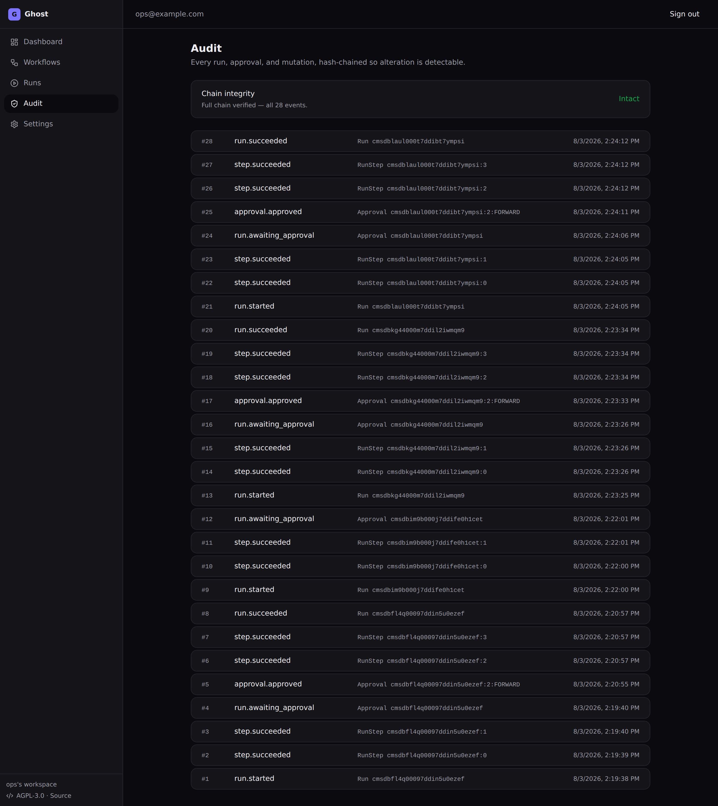

# Ghost

[](LICENSE)

> **Ghost is the trust runtime AI agents plug into** — teach it a business
> workflow once; agents may propose and start runs; humans approve sensitive
> steps; Ghost executes, verifies, and audits.

```text
Agent (propose) → Ghost (approve · execute · verify · audit)
Capture → Review → Approve → Execute → Verify → Recover
```

Prefer, in order: **APIs → browser automation → desktop automation → vision
fallback.** AI may propose; deterministic code executes only approved plans.
Ghost is not another autonomous agent.

**Who it's for:** operations-heavy SMBs — wholesale distributors, property
managers, accounting/bookkeeping firms, logistics, recruiting, financial-ops and
healthcare-admin teams — anyone with recurring, measurable work that spans
several systems and can't afford silent mistakes.

## What that looks like

A run reaches a step that submits an order — and stops. The classifier that
decided this is a pure function over the step definition, not a model call.


Approve, and the run resumes from the captured browser session — no prior step
is replayed — verifies the outcome, and reports what it could not reverse:


Every run, approval, and mutation appends to a per-org hash chain:



## Current product: Ghost Cloud (`cloud/`)

The active product is a **cloud SaaS** in [`cloud/`](cloud/) — Next.js + Node
worker + Postgres + Redis + Playwright.

| MVP pillar | Status |
|---|---|
| Record a browser workflow | Phase 2 |
| Convert recording → editable steps | Phase 2 |
| Replay across browser / API | **Phase 1 — built** |
| Approval before sensitive actions | **Phase 1 — built** |
| Log every run (screenshots, verify, audit) | **Phase 1 — built** |
| Agent HTTP + MCP tools (no self-approve) | **built** — [`cloud/docs/AGENT_PLUGIN.md`](cloud/docs/AGENT_PLUGIN.md) |

### Try it

```bash
cd cloud && pnpm demo
```

That configures `.env`, installs dependencies, brings up Postgres + Redis
(reusing whatever is already listening, else Docker), applies the schema,
installs Chromium, and starts the app on http://localhost:3000. It is
idempotent — re-running it also repairs a half-configured checkout.

Then: sign in with any email → **Workflows → Create demo workflow → Run** →
approve "Submit order" → run **SUCCEEDED**.

<details>
<summary>Or set it up step by step</summary>

```bash
cd cloud
cp .env.example .env          # works as-is for local dev
pnpm install
docker compose up -d          # Postgres + Redis
pnpm db:migrate
pnpm --filter @ghost/worker exec playwright install chromium
pnpm dev                      # http://localhost:3000
```

</details>

Docs: [`cloud/README.md`](cloud/README.md) ·
[`cloud/docs/PHASE_1_PLAN.md`](cloud/docs/PHASE_1_PLAN.md) ·
[`cloud/docs/CURSOR_HANDOFF.md`](cloud/docs/CURSOR_HANDOFF.md) ·
[`AGENTS.md`](AGENTS.md) · [`docs/README.md`](docs/README.md).

Validate: `cd cloud && pnpm typecheck && pnpm test && pnpm build` (239 tests).

**Contributing:** [`CONTRIBUTING.md`](CONTRIBUTING.md) — read the trust
invariants before changing execution or approval behaviour. Changes:
[`CHANGELOG.md`](CHANGELOG.md).

## Trust pipeline

Every meaningful operation:

```text
Intent → Plan → Policy check → User approval → Execution → Audit log → Undo path
```

- Deny risky actions by default (send, pay, delete, submit).
- Sensitive steps halt for a human; the classifier is deterministic, not AI.
- Runs append to a per-org hash-chained audit log.
- Connectors use scoped, revocable, least-privilege credentials — never around
  the approval + audit pipeline.

Why the gate is a pure function rather than a model call — worked through the
double-payment retry clamp, the step whose outcome nobody knows, and what the
audit chain provably does *not* catch:
[`docs/why-deterministic-gates.md`](docs/why-deterministic-gates.md).

## Legacy desktop app (superseded, retained)

The Rust/Tauri app at the repo root (`src-tauri/`, `src/`, `apps/macos/`) is the
previous local-first product (Ghost Organizer, record/replay). It remains in-tree
for reference and maintenance but is **not** the current product direction.

Published desktop release: **[v2.0.3](https://github.com/mohabbis/ghost/releases/tag/v2.0.3)**
(macOS notarized; Windows unsigned). See [`RELEASING.md`](RELEASING.md) and
desktop build notes in [`AGENTS.md`](AGENTS.md) if you need that tree.

## What Ghost is not

- Not a generic autonomous AI agent or chat wrapper.
- Not a no-code Zapier clone or blind macro recorder.
- Not silent — capture and sensitive execution are explicit, interruptible, and audited.

## License

**GNU Affero General Public License v3.0 or later** — see [LICENSE](LICENSE).

In practice: use it, read it, modify it, self-host it. The one obligation that
distinguishes AGPL from a permissive licence is [section
13](LICENSE) — if you run a modified Ghost as a network service other people
use, you have to offer those users the source of the version you are running.
Running it privately, or hosting it unmodified, triggers nothing extra.
