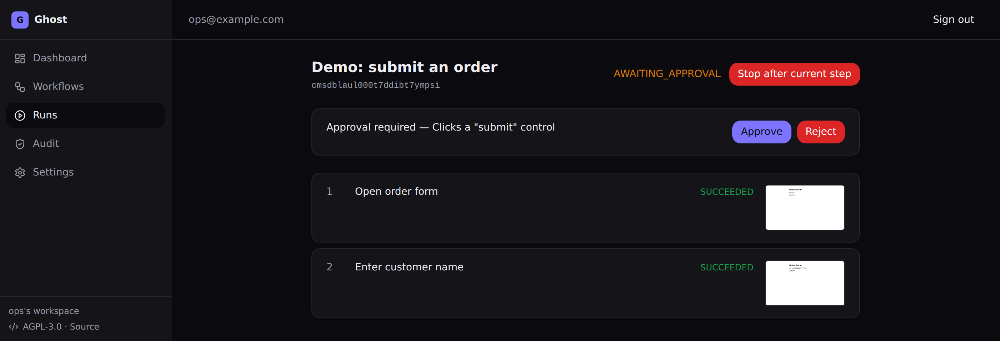
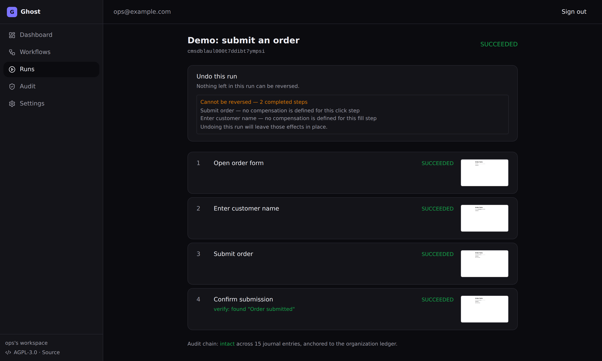

# Ghost Cloud

Ghost is the **governed execution / trust runtime AI agents plug into** — not
another autonomous agent.

```text
Agent (propose) → Ghost (approve · execute · verify · audit)
```

Teach it a business workflow once; it executes across software a company already
uses (APIs, browser automation, later desktop) with **human approval on sensitive
actions**, **verification**, and a **full execution log**. Agents may propose and
start runs via HTTP/MCP; they cannot approve.

This directory holds the cloud SaaS. It is a self-contained pnpm + Turborepo
workspace and does **not** share tooling with the repository root (which still
contains the legacy Rust/Tauri desktop app). Build and run everything from
inside `cloud/`.

## What Ghost does (MVP)

1. **Record** a browser workflow (a user performs the task once). — Phase 2
2. **Convert** the recording into an editable, step-by-step workflow. — Phase 2
3. **Replay** the workflow across browser / API actions. — **built (Phase 1)**
4. **Require approval** before sensitive actions (send, pay, delete, submit). — **built**
5. **Log** every run: per-step status, screenshots, verification, errors. — **built**

The engine shape is `Capture → Review → Approve → Execute → Verify → Recover`.
AI proposes; deterministic code executes only approved plans. The approval gate
is a pure state machine (`classifyStep` in `@ghost/core`) — no AI in that decision.

Which looks like this — a run stopped before it submits an order, with the
reason and the evidence of every step so far:



After approval the run resumes from the captured browser session rather than
replaying, verifies the outcome, and states what it cannot reverse:



## Layout

```
cloud/
  apps/
    web/       Next.js 15 (App Router) — UI + API + /api/agent/*         → Vercel
    worker/    Node worker: BullMQ consumers + Playwright execution     → container
    mcp/       Stdio MCP bridge for Cursor/Claude (no approve tools)
  packages/
    core/      Prisma, Zod steps, classifyStep, audit chain, agent catalog
```

Agent plugin details: [`docs/AGENT_PLUGIN.md`](docs/AGENT_PLUGIN.md).

- `apps/web` talks to Postgres (via `@ghost/core`) and enqueues jobs to Redis.
- `apps/worker` consumes those jobs and drives Playwright. Playwright needs a
  long-running container, which is why execution lives in the worker and not in
  Vercel serverless functions.
- `packages/core` is the single source of truth for the data model and the
  workflow schema, imported by both apps.

## Prerequisites

- Node >= 20 (repo is developed on Node 22)
- pnpm 10 (`corepack enable` to get the pinned version)
- Docker (for local Postgres + Redis)

## Getting started

```bash
cd cloud && pnpm demo
```

One command: writes `.env`, installs dependencies, brings up Postgres + Redis
(reusing whatever is already listening, otherwise via Docker), applies the
schema, installs Chromium, and starts web + worker. Idempotent — re-running it
repairs a half-configured checkout.

<details>
<summary>Step by step, if you would rather do it yourself</summary>

```bash
cd cloud
cp .env.example .env            # a working local config as-is
# Change before using against anything real:
#   AUTH_SECRET          -> `openssl rand -base64 32`
#   GHOST_SESSION_KEY    -> `openssl rand -base64 32` (must decode to 32 bytes)
# Set to an ABSOLUTE path shared by web+worker:
#   GHOST_ARTIFACT_DIR   -> e.g. $PWD/.artifacts
pnpm install                    # runs `prisma generate` via core postinstall
docker compose up -d            # Postgres :5432, Redis :6379
pnpm db:migrate                 # apply the Prisma schema
pnpm --filter @ghost/worker exec playwright install chromium
pnpm dev                        # web on http://localhost:3000 + worker
```

Two variables are load-bearing in ways their names do not advertise:

- **`GHOST_ARTIFACT_DIR`** must be an absolute path both processes share. The
  worker writes run screenshots there; the web app serves them. Point them at
  different places and every screenshot 404s, so whoever is at an approval gate
  decides with no evidence.
- **`GHOST_SESSION_KEY`** must decode to exactly 32 bytes. Empty means the
  worker skips session capture at a gate, and every approved run then ends
  `INCIDENT` instead of `SUCCEEDED` — correct fail-safe behaviour, but it breaks
  the demo and 16 tests. Add any new variable to `turbo.json` too, or Turbo
  strips it from `pnpm test` / `pnpm build`.

</details>

`pnpm dev` runs both apps via Turborepo. To run them separately:

```bash
pnpm --filter @ghost/web dev
pnpm --filter @ghost/worker dev
```

## Smoke test (Phase 1)

1. Open http://localhost:3000 and sign in (dev-credentials accepts any email;
   an `Organization` is created on first sign-in).
2. **Workflows → Create demo workflow → Run.**
3. Timeline: navigate + fill succeed with screenshots; run **halts** at
   "Submit order" (`AWAITING_APPROVAL`).
4. **Approve** → run resumes (worker restores page state), submits, verifies
   "Order submitted", finishes **SUCCEEDED**. **Reject** → run **FAILED**, no submit.

If screenshots don't render, `GHOST_ARTIFACT_DIR` is almost always not the same
absolute path for both processes. If Chromium won't launch, run the
`playwright install chromium` step above.

## Validation

```bash
pnpm typecheck
pnpm lint          # apps/web only — worker, mcp and core have no lint script yet
pnpm test          # includes DB-backed runWorkflow tests when DATABASE_URL is set
pnpm build
```

`pnpm lint` is the weakest of these four. Only `apps/web` has an ESLint config,
and `turbo run lint` skips packages that define no `lint` script — silently, and
with a green summary. Treat `typecheck` as the real static gate until the other
three packages have configs.

A full green run is **239 tests**. Roughly 90 of them are gated on
`Boolean(process.env.DATABASE_URL)` and **skip silently** without it — so a
green run with no database covers none of the execution engine. If the worker
suite reports 45 tests rather than 90, the database is not being reached.

## Status

| Phase | What | Status |
|---|---|---|
| 0 | Workspace, Prisma, Auth.js, app shell, BullMQ wiring | **done** |
| 1.1 | Playwright engine, approval state machine, artifacts, hash-chained audit | **done** |
| 1.2 | Run trigger, live timeline, approve/reject resume | **done** |
| 1.3 | Durable execution (run journal), timeouts/retry, incidents + cancel, audit-verify, variable store | **done** |
| 1.x | Typed step editor | remaining |
| 2 | Browser recording → editable steps | convert built (upload → HarnessRouter compile → review); capture mechanism still open |

Phase 1.3 made run position a fold over an append-only, hash-chained journal
instead of a stored cursor, so a completed step cannot execute twice after a
crash — see [`docs/PRIOR_ART.md`](docs/PRIOR_ART.md) for what that borrows from
Temporal, Camunda, Windmill and n8n, and what it deliberately refuses.

Authoritative handoff: [`docs/CURSOR_HANDOFF.md`](docs/CURSOR_HANDOFF.md).
Phase 1 plan: [`docs/PHASE_1_PLAN.md`](docs/PHASE_1_PLAN.md).
Prior art and design rationale: [`docs/PRIOR_ART.md`](docs/PRIOR_ART.md).
