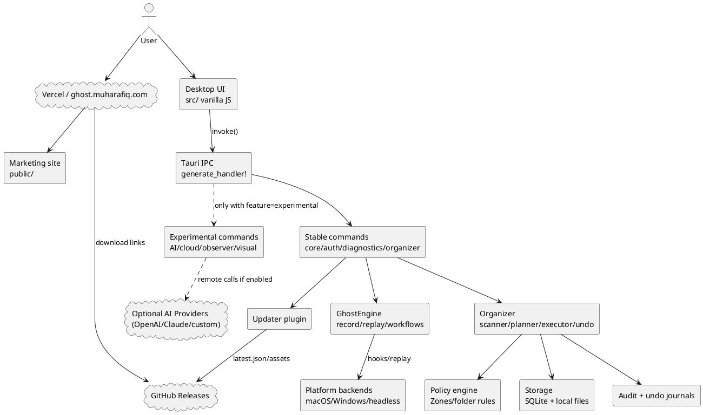

# Ghost Product and Repository Audit

Audit date: 2026-07-11. Reviewed local checkout `52d3f3f8ec788a9ba1b1c9c8c5874985dc044ce0` on branch `work`, public repository `mohabbis/ghost`, and live site `https://ghost.muharafiq.com/`.

## 1. Executive Summary

- **Overall readiness rating:** Technical preview.
- **Security posture:** The trusted Organizer path has meaningful controls (server-side re-planning, policy re-check, no overwrite, undo-first records), but release/update trust is incomplete because the updater public key is still a placeholder and the latest public GitHub release shown by GitHub is `v1.2.4` while the site/repo claim `v1.2.6`.
- **Product-claim accuracy:** Partially accurate for Ghost Organizer; overstated for one-click undo, replay safety, Guard Desk/POS Bridge, and signed updater/download trust.
- **Release readiness:** Not ready for a public trust-sensitive release until version/download integrity, updater signing, notarization/signing, and website wording are corrected.
- **Top five blockers:**
  1. Site and README claim `v1.2.6`, but GitHub's repository page reports latest release `v1.2.4`.
  2. `tauri.conf.json` contains a placeholder updater public key, contradicting “signed auto-updater” language.
  3. Website presents Guard Desk + POS Bridge as a product use case although local code appears to provide deterministic parsing/rule prototypes, not certified check/ID/POS compliance.
  4. Replay remains high-risk: legacy replay commands are stable while documentation admits the legacy recording/replay surface is not yet wired to the policy engine.
  5. GitHub Actions use mutable major tags (`actions/checkout@v7`, `actions/cache@v6`, etc.) and release signing is optional.
- **Recommended immediate decision:** Keep Ghost labeled as a technical preview; qualify public claims; do not promote Guard Desk/POS Bridge or replay as production-safe until release integrity and approval/policy gates are verified end-to-end.

## 2. Scope and Methodology

### URLs reviewed
- Live site: `https://ghost.muharafiq.com/` via browser-fetch tooling.
- Repository: `https://github.com/mohabbis/ghost` via browser-fetch tooling.
- Releases page: `https://github.com/mohabbis/ghost/releases` via browser-fetch tooling.

### Repository state reviewed
- Branch: `work`.
- Commit: `52d3f3f8ec788a9ba1b1c9c8c5874985dc044ce0`.
- Local GitHub remote: `origin`.
- Public GitHub page evidence: default branch `master`, 288 commits, 0 open PRs, 18 releases, latest public release `v1.2.4` dated 2026-07-10.

### Commands executed
- `pwd && find .. -name AGENTS.md -print && git status --short --branch && git branch -a --verbose --no-abbrev | head -80 && git rev-parse HEAD && git remote -v`
- `rg --files -g '!*target*' | sed -n '1,220p'`
- `sed -n '1,220p' src-tauri/tauri.conf.json`
- `sed -n '1,220p' src-tauri/Cargo.toml`
- `sed -n '1,160p' src-tauri/capabilities/default.json`
- `sed -n '1,220p' src-tauri/src/lib.rs`
- `sed -n '1,220p' src-tauri/src/commands/core.rs`
- `sed -n '1,220p' src-tauri/src/commands/organizer.rs`
- `sed -n '1,260p' src-tauri/src/organizer/executor.rs`
- `sed -n '1,260p' public/index.html`
- `sed -n '1,240p' public/main.js`
- `cargo fmt --manifest-path src-tauri/Cargo.toml -- --check`
- `cargo check --manifest-path src-tauri/Cargo.toml --all-targets` (failed: missing Linux `dbus-1` development package)
- `cargo test --manifest-path src-tauri/Cargo.toml` (failed: missing Linux `dbus-1` development package)
- `cargo audit --deny warnings` and `cargo deny check` (tools not installed in the environment)

### Audit limitations
- I did not execute destructive desktop automation or mutate real user files.
- I did not perform macOS/Windows runtime automation testing because this environment is Linux/headless.
- Direct Python/curl access to GitHub API and the live site was blocked by a tunnel/proxy `403`; browser-fetch tooling could read the pages, but HTTP header verification was limited.
- I did not verify binary signatures or notarization on actual release artifacts in this environment.

## 3. Product Claim Reconciliation

| Area | Website Claim | Repository Claim | Verified Implementation | Status |
|---|---|---|---|---|
| Version | Site hero/download display `v1.2.6`. | `Cargo.toml` and `tauri.conf.json` are `1.2.6`; release docs mention `v1.2.6`. | GitHub public repo page reports latest release `v1.2.4`, creating a release-channel mismatch. | Contradictory |
| macOS/Windows downloads | Download buttons point to latest `Ghost.dmg` and `Ghost_Setup.exe`. | README uses the same latest release asset names. | Links are present in markup, but latest release reported by GitHub is not `v1.2.6`; assets were not signature-verified. | Partially verified |
| Code signing/notarization | Site says preview release and macOS may be ad-hoc signed. | Release docs explicitly say notarization depends on Apple secrets and ad-hoc signing remains possible. | Consistent disclosure, but not verified on artifacts. | Partially verified |
| Files never leave machine | “Your files never leave this machine” / “nothing uploaded.” | README says no cloud-first storage and no unapproved network calls. | Core dependencies include `reqwest`; updater checks GitHub; experimental cloud/LLM code exists but gated. Claim is directionally true for Organizer, not absolute for all features. | Partially verified |
| No account/API key required | Site says local-first/no account. | LLM code supports API keys from env/config for experimental AI; default build gates experimental commands. | Accurate for default Organizer; should exclude experimental AI/cloud. | Partially verified |
| Typed-text redaction | Demo says typed text redacted by default. | Guard/core code sanitizes obvious secrets and suppresses keyboard after sensitive clicks. | Heuristic, not universal; docs should avoid implying all typed text is always redacted. | Partially verified |
| Password/payment suppression | Site says password/payment fields are suppressed. | macOS code checks AX secure fields; guard heuristics identify credential-like targets. | macOS has explicit secure-field logic; Windows evidence was weaker in quick audit. | Partially verified |
| Audit logs | Site/README claim every change is audited. | Organizer executor records audit events and execution storage persists audit JSON. | Verified for Organizer executor; replay audit coverage is less complete. | Partially verified |
| One-click undo | Site says one-click undo. | Organizer undo exists and refuses occupied origin/non-empty folder removal. | Undo is best-effort and can skip; “one-click” should be qualified as reversible Organizer actions. | Misleading |
| Deterministic execution | Site claims deterministic code executes only approved actions. | Organizer command re-plans server-side and executor re-checks policy. | Verified for Organizer. Legacy replay is not fully policy-bound. | Partially verified |
| No silent delete/overwrite | Site says never deleted/overwritten silently. | Organizer refuses delete rules and executor skips existing targets. | Verified in Organizer code path. | Verified |
| Local compliance checks | Site includes Guard Desk/compliance-style language. | Fraud/compliance modules exist. | Appears prototype/deterministic rules; not evidence of certified compliance product. | Misleading |
| Guard Desk/POS Bridge | Website presents a “Guard Desk + POS Bridge” demo/workflow. | `core/id_scan`, fraud/check modules exist; no verified production POS bridge. | Browser demo is simulation; actual POS automation support not verified. | Misleading |
| AI-assisted planning | Site says AI may propose; deterministic code executes approved plans. | Experimental AI commands gated under Cargo feature; LLM provider code can call OpenAI/Claude/custom endpoints. | Boundary is documented and command-gated, but website should state remote AI is experimental and may use API keys if enabled. | Partially verified |
| Workflow recording/replay | Site claims record/replay preview and status. | Stable commands include start/stop recording, replay, dry-run, pause/resume/cancel. | Implemented, but docs admit legacy replay is not yet wired to policy engine. | Partially verified |
| Semantic/window-aware targeting | Site mentions semantic targeting/per-click trace. | macOS/Windows locators exist; README says target resolution still being hardened. | Partially implemented; reliability not proven. | Partially verified |

## 4. Architecture

### System description
Ghost is a Tauri 2 desktop app with a static marketing site. The packaged app uses vanilla HTML/CSS/JS from `src/`, a Rust backend under `src-tauri/src/`, Tauri IPC commands registered in `src-tauri/src/lib.rs`, local SQLite-backed storage for Zones/executions, platform modules for macOS/Windows/headless recording and replay, and static marketing content under `public/` deployed via Vercel workflow.

### PlantUML component diagram

### Trust boundaries
- **Browser/site boundary:** static marketing and download links; no proof of binary integrity beyond linked checksums.
- **Tauri IPC boundary:** all frontend-originated calls enter privileged Rust functions registered in `generate_handler!`.
- **Filesystem boundary:** Organizer operates through Zones/folder rules and policy checks.
- **OS-control boundary:** recording/replay uses platform-specific hooks/input synthesis and requires stronger approval than the Organizer file path.
- **Network boundary:** default app should avoid network except updater; experimental LLM/cloud code can cross network if compiled/configured.

### Stable versus experimental components
- **Stable:** Organizer, Zones/folder rules, workflow storage, auth, diagnostics, update checks, core recording/replay commands.
- **Experimental/gated:** AI generation/analysis, cloud sync, observer mode, visual checks, analytics, data sources.
- **Risk note:** recording/replay is stable but still less mature than Organizer because command registry states the legacy surface is not yet wired to the policy engine.

## 5. Findings

### FINDING-PROD-001: Public version/download mismatch
- **Severity:** High
- **Confidence:** High
- **Affected component:** Website, README, release process.
- **Evidence:** Site and README state `v1.2.6`; GitHub repository page reports latest release `v1.2.4`.
- **User impact:** Users may download an older build while reading claims for a newer build.
- **Exploit or failure scenario:** A safety fix in `1.2.6` is advertised but the latest download resolves to `1.2.4`.
- **Recommended remediation:** Publish a `v1.2.6` GitHub Release with both assets and checksums, or change site/README to the actual latest release.
- **Suggested owner:** Release engineering.
- **Estimated effort:** S
- **Release blocker:** Yes

### FINDING-REL-002: Updater signing key is a placeholder
- **Severity:** High
- **Confidence:** High
- **Affected component:** Tauri updater/release integrity.
- **Evidence:** `tauri.conf.json` uses `REPLACE_WITH_OUTPUT_OF_cargo_tauri_signer_generate` as updater pubkey.
- **User impact:** Signed updater claims are not supportable in default builds.
- **Exploit or failure scenario:** Update checks fail silently or users believe update artifacts are signature-enforced when they are not configured.
- **Recommended remediation:** Generate a real Tauri updater keypair, store the private key in GitHub secrets, embed the public key, publish `latest.json`, and add CI verification that the placeholder is absent.
- **Suggested owner:** Release engineering/security.
- **Estimated effort:** S
- **Release blocker:** Yes

### FINDING-AUTO-003: Replay surface is stable but not policy-bound like Organizer
- **Severity:** High
- **Confidence:** High
- **Affected component:** `commands::replay_workflow`, `GhostEngine`, platform replay.
- **Evidence:** Command registry says legacy recording/replay is not yet wired to the policy engine; `replay_workflow` accepts frontend-supplied events.
- **User impact:** Approved-plan guarantees are strongest for Organizer, not for arbitrary desktop replay.
- **Exploit or failure scenario:** A compromised frontend or stale workflow replays OS input in an unexpected target context.
- **Recommended remediation:** Add a replay approval object persisted server-side, target-window validation, policy check, emergency-stop tests, and refuse direct replay of arbitrary event vectors in production UI.
- **Suggested owner:** Desktop automation lead.
- **Estimated effort:** L
- **Release blocker:** Yes for public replay claims.

### FINDING-FS-004: Organizer safety is strong but symlink/TOCTOU coverage needs explicit tests
- **Severity:** Medium
- **Confidence:** Medium
- **Affected component:** Organizer planner/executor/policy.
- **Evidence:** Executor checks source/target existence and avoids overwrites, but quick audit did not verify symlink escape or inode-change detection tests.
- **User impact:** Edge-case filesystem changes could escape the intended boundary or make audit records misleading.
- **Exploit or failure scenario:** A symlink or directory swap between scan and execute points a move outside the approved Zone.
- **Recommended remediation:** Canonicalize and re-stat source/target at execution; add synthetic tests for symlinks, case-only renames, Unicode, long paths, and TOCTOU swaps.
- **Suggested owner:** Organizer/backend.
- **Estimated effort:** M
- **Release blocker:** Yes before public beta.

### FINDING-WEB-005: Website overstates Guard Desk/POS Bridge readiness
- **Severity:** High
- **Confidence:** Medium
- **Affected component:** Marketing website, Guard Desk demo.
- **Evidence:** Site has a Guard Desk + POS Bridge section and demo; implementation evidence indicates local OCR/ID parsing and fraud-rule prototypes, not a production financial compliance/POS bridge.
- **User impact:** Financial-services users may infer identity verification, check fraud, AML/KYC, or regulatory compliance capability that is not proven.
- **Exploit or failure scenario:** A user relies on a demo-like check/ID match as a compliance control.
- **Recommended remediation:** Label Guard Desk as browser-only simulation/prototype; add “not KYC/AML/sanctions/compliance certification” disclosure; move POS Bridge to roadmap until field mapping, approval, audit, and retention controls exist.
- **Suggested owner:** Product/website.
- **Estimated effort:** XS
- **Release blocker:** Yes for website.

### FINDING-PRIV-006: “Nothing uploaded” is too absolute
- **Severity:** Medium
- **Confidence:** High
- **Affected component:** Website/privacy copy.
- **Evidence:** Updater network endpoint is configured; LLM/cloud code exists behind experimental features; site says “nothing uploaded.”
- **User impact:** Users cannot distinguish default Organizer privacy from experimental/network-enabled behavior.
- **Exploit or failure scenario:** A build with experimental AI sends prompts to a provider while marketing implies no network path exists.
- **Recommended remediation:** Reword to “Organizer files are processed locally by default; update checks contact GitHub; experimental AI/cloud features can make network calls only when enabled/configured.”
- **Suggested owner:** Product/security.
- **Estimated effort:** XS
- **Release blocker:** Yes for public copy.

### FINDING-SUPPLY-007: GitHub Actions are not pinned to immutable SHAs
- **Severity:** Medium
- **Confidence:** High
- **Affected component:** `.github/workflows/*`.
- **Evidence:** Workflows use mutable tags such as `actions/checkout@v7`, `actions/setup-node@v6`, `actions/cache@v6`, and CodeQL major tags.
- **User impact:** Build/release supply chain can change outside repository review.
- **Exploit or failure scenario:** A compromised or changed action tag affects release artifacts.
- **Recommended remediation:** Pin third-party actions to full commit SHAs and enable Dependabot updates for GitHub Actions.
- **Suggested owner:** DevSecOps.
- **Estimated effort:** S
- **Release blocker:** Before production candidate.

### FINDING-SEC-008: Tauri CSP allows inline styles and global Tauri API
- **Severity:** Medium
- **Confidence:** High
- **Affected component:** Tauri frontend security.
- **Evidence:** `withGlobalTauri` is enabled and CSP allows `style-src 'self' 'unsafe-inline'`.
- **User impact:** XSS impact is higher because injected frontend code can call privileged IPC.
- **Exploit or failure scenario:** A DOM injection in static UI invokes native commands.
- **Recommended remediation:** Disable `withGlobalTauri` if feasible, use imported Tauri API, tighten CSP, and add frontend tests/lints preventing `innerHTML` with untrusted data.
- **Suggested owner:** Frontend/security.
- **Estimated effort:** M
- **Release blocker:** Before public beta.

### FINDING-A11Y-009: Interactive demo likely has accessibility gaps
- **Severity:** Medium
- **Confidence:** Medium
- **Affected component:** Marketing website.
- **Evidence:** Demo dynamically fills lists and uses animated interactive controls; no automated a11y test was found in website workflow.
- **User impact:** Keyboard/screen-reader users may miss demo state changes or focus feedback.
- **Exploit or failure scenario:** A user cannot verify download/security information using keyboard or assistive tech.
- **Recommended remediation:** Add Playwright/axe checks for tab order, focus state, contrast, reduced motion, and ARIA live-region behavior.
- **Suggested owner:** Frontend.
- **Estimated effort:** S
- **Release blocker:** No.

### FINDING-TEST-010: Runtime safety matrix is broader than current automated tests
- **Severity:** High
- **Confidence:** Medium
- **Affected component:** Tests and release gates.
- **Evidence:** Tests exist for Organizer/replay contracts, but no evidence of installer smoke tests, crash-recovery/fault-injection matrix, or native automation fixture tests.
- **User impact:** Safety claims rely on code inspection and unit tests, not enough adverse runtime evidence.
- **Exploit or failure scenario:** Cross-volume move, disk-full, locked file, or crash leaves incomplete audit/undo state.
- **Recommended remediation:** Add filesystem fault-injection tests and platform fixture smoke tests to CI; keep public release blocked until the critical matrix passes.
- **Suggested owner:** QA/backend.
- **Estimated effort:** L
- **Release blocker:** Before public beta.

## 6. Risk Register

| ID | Risk | Likelihood | Impact | Severity | Mitigation | Owner |
|---|---|---:|---:|---|---|---|
| R1 | Users download `v1.2.4` while site advertises `v1.2.6` | High | High | High | Publish matching release or correct copy | Release engineering |
| R2 | Updater cannot prove signatures because pubkey is placeholder | High | High | High | Configure updater key and verify in CI | Security/release |
| R3 | Replay executes in wrong context | Medium | High | High | Policy-bound replay approvals and target validation | Desktop automation |
| R4 | Symlink/TOCTOU filesystem escape | Medium | High | High | Canonicalize/re-stat and add adversarial FS tests | Organizer backend |
| R5 | Compliance demo misconstrued as certified capability | Medium | High | High | Reword site, add disclaimers, gate feature | Product |
| R6 | Experimental AI/network behavior weakens privacy claims | Medium | Medium | Medium | Explicit feature gating and privacy copy | Product/security |
| R7 | Mutable Actions tags alter release supply chain | Medium | Medium | Medium | Pin actions to SHAs | DevSecOps |

## 7. Release-Readiness Checklist

| Item | Status | Evidence/notes |
|---|---|---|
| Website version matches GitHub latest release | Fail | Site/repo claim `v1.2.6`; GitHub page says latest `v1.2.4`. |
| macOS artifact exists and is signed/notarized | Not tested | Link present; artifact signature not verified. |
| Windows artifact exists and is signed | Not tested | Link present; Authenticode not verified. |
| SHA256 checksums cover all release assets | Not tested | Link present; content not fetched. |
| Updater public key configured | Fail | Placeholder pubkey in `tauri.conf.json`. |
| PR CI includes Rust fmt/check/test/clippy | Pass | Workflow defines these gates. |
| CI tests macOS and Windows compile | Pass | Tauri compile smoke matrix exists. |
| Release workflow builds both platforms before publish | Pass | Release workflow describes parallel platform jobs and publish. |
| Actions pinned to immutable SHAs | Fail | Mutable action tags used. |
| Organizer no-overwrite/no-delete invariant | Pass | Executor and command guards enforce this in code. |
| Organizer undo-first persistence before mutation | Partial | Undo journal entries are recorded before mutation in memory; durable execution storage happens after report completion. |
| Replay approval/policy boundary | Partial | Dry-run and controls exist; legacy replay not policy-engine wired. |
| AI output cannot directly execute | Partial | Experimental command gate supports boundary; generated workflows still need schema/policy verification before production. |
| Website Guard Desk accuracy | Fail | Demo/copy overstates readiness. |

## 8. Remediation Roadmap

### First 48 Hours
1. Correct public version/download mismatch: publish `v1.2.6` release assets or change website/README to `v1.2.4`.
2. Replace “nothing uploaded” with scoped wording that excludes update checks and experimental AI/cloud.
3. Label Guard Desk/POS Bridge as simulation/prototype and add non-compliance disclaimer.
4. Remove “signed auto-updater” public claim until a real updater public key and `latest.json` are shipped.

### Before the Next Public Release
1. Configure Tauri updater signing and verify artifacts/checksums in CI.
2. Add release job assertions that Cargo/Tauri/site versions equal the tag.
3. Add link checks for `Ghost.dmg`, `Ghost_Setup.exe`, `SHA256SUMS.txt`, and `latest.json`.
4. Add Organizer symlink/TOCTOU/case/Unicode/locked-file tests.

### Before Public Beta
1. Policy-bind replay: approved replay manifest, target validation, emergency stop integration tests.
2. Pin GitHub Actions to immutable SHAs.
3. Add website accessibility/performance checks.
4. Add installer smoke tests on macOS/Windows.
5. Add privacy data inventory and user purge/export controls documentation.

### Before Production Use
1. Developer ID signing + notarization and Windows Authenticode/Azure signing verified from downloaded artifacts.
2. Formal threat model update for IPC and OS-control paths.
3. Crash-recovery and disk-full fault injection for Organizer.
4. Security review of experimental AI/cloud before enabling in default UI.
5. Support/uninstall/revoke-permissions documentation.

## 9. Prioritized Backlog

### P0: Version and release consistency gate
- **Problem:** Public version and latest release differ.
- **Scope:** Release workflow, website, README.
- **Acceptance criteria:** CI fails if `Cargo.toml`, `tauri.conf.json`, website copy, README, and tag disagree; latest release assets match displayed version.
- **Dependencies:** GitHub Releases permissions.
- **Suggested files/modules:** `.github/workflows/release.yml`, `.github/workflows/deploy-website.yml`, `public/index.html`, `README.md`.
- **Verification method:** Tag `vX.Y.Z`; assert release assets and site display `X.Y.Z`.
- **Priority:** P0
- **Effort:** S

### P0: Configure signed updater
- **Problem:** Placeholder updater key contradicts signed update claims.
- **Scope:** Tauri config, release secrets, latest.json generation.
- **Acceptance criteria:** Placeholder string absent; `check_for_update` succeeds against a signed release; tampered signature is rejected.
- **Dependencies:** Tauri signing key.
- **Suggested files/modules:** `src-tauri/tauri.conf.json`, `.github/workflows/release.yml`, `docs/auto-update.md`.
- **Verification method:** Build signed updater artifacts and run update verification test.
- **Priority:** P0
- **Effort:** S

### P0: Guard Desk copy downgrade
- **Problem:** Website implies financial compliance/POS production capability.
- **Scope:** Marketing copy and demo labels.
- **Acceptance criteria:** Guard Desk is clearly “simulation/prototype”; no AML/KYC/fraud-certification implication; POS Bridge moved to roadmap.
- **Dependencies:** Product decision.
- **Suggested files/modules:** `public/index.html`, `public/main.js`, `README.md` if applicable.
- **Verification method:** Content review checklist.
- **Priority:** P0
- **Effort:** XS

### P1: Replay approval manifest
- **Problem:** Stable replay can execute frontend-supplied events without Organizer-style policy.
- **Scope:** IPC, engine, UI approval flow.
- **Acceptance criteria:** Replay requires a server-created manifest hash and target app/window validation; stale/tampered event vectors fail.
- **Dependencies:** Target identity model.
- **Suggested files/modules:** `src-tauri/src/commands/core.rs`, `src-tauri/src/engine.rs`, `src-tauri/src/platform/*`, `src/main.js`.
- **Verification method:** IPC contract tests and platform fixture tests.
- **Priority:** P1
- **Effort:** L

### P1: Filesystem adversarial test suite
- **Problem:** Organizer lacks verified coverage for edge cases in the user request.
- **Scope:** Rust tests and executor hardening.
- **Acceptance criteria:** Tests cover duplicate names, case-only renames, Unicode, symlinks, locked/read-only files, TOCTOU, partial failures, repeated undo.
- **Dependencies:** Test utilities.
- **Suggested files/modules:** `src-tauri/src/organizer/executor.rs`, `src-tauri/src/organizer/undo.rs`, `src-tauri/tests/*`.
- **Verification method:** `cargo test --manifest-path src-tauri/Cargo.toml organizer`.
- **Priority:** P1
- **Effort:** M

### P2: Supply-chain pinning
- **Problem:** Mutable action tags in CI/release.
- **Scope:** GitHub Actions.
- **Acceptance criteria:** All third-party actions pinned to full SHAs; Dependabot updates actions.
- **Dependencies:** None.
- **Suggested files/modules:** `.github/workflows/*.yml`, `.github/dependabot.yml`.
- **Verification method:** Static check grepping `uses:` entries.
- **Priority:** P2
- **Effort:** S

## 10. Final Verdict

1. **Is the website accurate?** Partially. Organizer safety claims are substantially aligned, but version, Guard Desk/POS, “nothing uploaded,” one-click undo, and replay-readiness claims need qualification.
2. **Are the downloads trustworthy?** Not enough evidence. Links exist, but latest-release mismatch, unverified signatures, and placeholder updater key block a high-trust answer.
3. **Is the repository architecture appropriate?** Broadly yes: Tauri IPC, Rust command modules, Organizer/policy/audit boundaries are sensible. However, stable replay needs stronger policy binding.
4. **Are the privacy claims supportable?** Supportable only for default local Organizer with qualified wording. Not supportable as an absolute statement across updater/experimental AI/cloud.
5. **Is the undo model safe?** Organizer undo is thoughtfully designed, but “one-click undo” should be framed as best-effort reversible operations; durable-before-mutation crash semantics need more proof.
6. **Is replay safe enough for public use?** Not as a production-safe claim. It is a technical-preview feature until target validation, policy-bound approvals, and platform fixture tests are complete.
7. **Are AI features sufficiently constrained?** The command surface is gated and intended suggestion-only, but remote provider behavior and generated workflow validation must stay experimental and visibly labeled.
8. **Is Guard Desk a real capability or only a demonstration?** Based on this audit, it should be treated as a browser simulation/prototype plus partial local parsing/rules, not a production compliance/POS capability.
9. **What is the appropriate current product-stage label?** Technical preview.
10. **What must be fixed before the next release?** Version/download consistency, updater signing configuration or claim removal, Guard Desk/POS copy, privacy wording, and release integrity checks.
